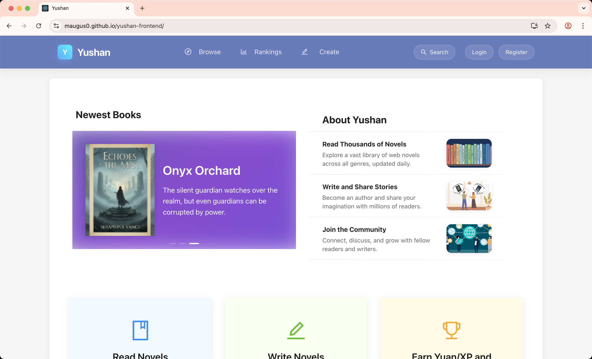

# Yushan Platform Documentation

> 📚 **Complete documentation and architecture guide for Yushan Platform** - A gamified web novel reading platform with monolithic (Phase 1) and microservices (Phase 2) architectures, with Phase 3 planned for Kubernetes and AWS deployment.

## 🎬 Demo Videos

<div align="center">

<a href="https://www.youtube.com/watch?v=0dc7Z0p1V4E">
  
</a>
<br>
<em>Platform Features Demo</em>
<br>

</div>

## 📋 Overview

This repository contains comprehensive documentation for the **Yushan Platform** - a gamified web novel reading platform that transforms reading into an engaging, social experience. The platform has been developed in multiple phases, each representing a significant architectural evolution.

## 🎯 Project Phases

### Phase 1: Monolithic Architecture ✅ **Complete**

**Status**: ✅ Production Ready | **Deployment**: Railway (Backend)

**Description**: Initial implementation with all features in a single application.

**Repositories**:
- [yushan-monolithic-backend](https://github.com/phutruonnttn/yushan-monolithic-backend) - Spring Boot 3.5.7, Java 21, PostgreSQL, Redis
- [yushan-monolithic-frontend](https://github.com/phutruonnttn/yushan-monolithic-frontend) - React 19, Redux Toolkit, Ant Design
- [yushan-monolithic-admin-dashboard](https://github.com/phutruonnttn/yushan-monolithic-admin-dashboard) - React 18, Ant Design

**Key Features**:
- Complete user management and authentication
- Novel and chapter management
- Social features (comments, reviews, votes)
- Gamification (XP, achievements, leaderboards)
- Analytics and rankings
- Admin dashboard

**Tech Stack**:
- **Backend**: Spring Boot 3.5.7, Java 21, PostgreSQL, Redis, JWT
- **Frontend**: React 19, Redux Toolkit, Ant Design
- **Deployment**: Railway (Backend), GitHub Pages (Frontend)
- **Architecture Pattern**: Monolithic (Single Application)
- **Data Access**: JPA/Hibernate, MyBatis
- **Security**: JWT Authentication, Spring Security

---

### Phase 2: Microservices Architecture ✅ **Complete**

**Status**: ✅ Production Ready | **Deployment**: Digital Ocean (Backend) | **Frontend**: GitHub Pages (Cloned from Phase 1)

**Description**: Refactored into microservices architecture for better scalability and maintainability. **All backend services are deployed on Digital Ocean using Terraform**. The frontend applications are cloned from Phase 1 monolithic frontend repositories into separate Phase 2 repositories, with only the backend API endpoints updated to connect to the new microservices API Gateway.

**Additional Improvements** (preparation for Phase 3):
- ✅ **Rich Domain Model refactoring** completed for user-service, content-service, and engagement-service
  - Converted Anemic Domain Models to Rich Domain Models
  - Added business logic methods to entities (changeStatus, publish, archive, updateContent, etc.)
  - Updated services to use business methods instead of direct setters
  - All tests passing (user-service: 309 unit + 32 integration, engagement-service: 664 unit + 2 integration, content-service: 571 unit + 53 integration)
  - This improvement is part of Phase 3 roadmap but implemented in Phase 2 codebase

**Deployment Strategy**:
- **Backend**: All microservices deployed on **Digital Ocean** using Terraform (Infrastructure as Code)
- **Frontend**: **Cloned from Phase 1** - Frontend applications are cloned from monolithic frontend repos into separate Phase 2 repos, with only backend API endpoint configuration changed
- **Frontend Deployment**: Continue to be deployed on **GitHub Pages** (same as Phase 1)
- **API Endpoints**: Only backend API endpoints are updated in frontend configuration to connect to the new microservices API Gateway

**Infrastructure Services** (Deployed on Digital Ocean):
- [yushan-platform-service-registry](https://github.com/maugus0/yushan-platform-service-registry) - Eureka Service Discovery (Port 8761)
  - Service registration and discovery
  - Health monitoring
  - Load balancing support
- [yushan-config-server](https://github.com/maugus0/yushan-config-server) - Spring Cloud Config Server (Port 8888)
  - Centralized configuration management
  - Git Backend - Reads configs from GitHub repository
  - Environment-specific overrides
  - Automatic config refresh from Git repo
- [yushan-api-gateway](https://github.com/maugus0/yushan-api-gateway) - Spring Cloud Gateway (Port 8080)
  - Single entry point for all API requests
  - Route definitions with path rewriting
  - Request/response logging and metrics
  - CORS configuration
  - Load balancing via Eureka discovery

**Business Services** (Deployed on Digital Ocean):
- [yushan-user-service](https://github.com/maugus0/yushan-user-service) - User management & authentication (Port 8081)
  - Authentication (JWT, refresh tokens, email verification)
  - User profile management
  - Library management (reading progress)
  - Admin operations (user promotion, status management)
  - Author upgrade and verification
  - Kafka event producer (`user.events`, `active`)
  - Tech: Spring Boot 3, MyBatis, PostgreSQL, Redis, Kafka
- [yushan-content-service](https://github.com/maugus0/yushan-content-service) - Novel & chapter management (Port 8082)
  - Novel and chapter CRUD operations
  - Full-text search with Elasticsearch 8.11
  - Category and tag management
  - File storage (Local/S3/Digital Ocean Spaces)
  - Content moderation and approval workflow
  - Elasticsearch auto-indexing on startup
  - Kafka event producer (`novel.events`, `chapter.events`)
  - Tech: Spring Boot, JPA + MyBatis hybrid, Elasticsearch, Kafka
- [yushan-engagement-service](https://github.com/maugus0/yushan-engagement-service) - Comments, reviews, votes (Port 8084)
  - Comment system (CRUD, moderation, spoiler tags)
  - Review and rating management
  - Vote system with Yuan currency integration
  - Report management
  - Notification support
  - Kafka event producer (`comment-events`, `review-events`, `vote-events`, `active`)
  - Tech: Spring Boot, MyBatis, Kafka, Redis
- [yushan-gamification-service](https://github.com/maugus0/yushan-gamification-service) - XP, achievements, Yuan (Port 8085)
  - EXP (Experience Points) and level system
  - Yuan currency management
  - Achievement system with automatic unlocking
  - Daily login rewards and streaks
  - Leaderboard support
  - Kafka event listeners (`user.events`, `comment-events`, `review-events`, `vote-events`)
  - Tech: Spring Boot, MyBatis, Kafka listeners, Redis, PostgreSQL
- [yushan-analytics-service](https://github.com/maugus0/yushan-analytics-service) - Analytics & rankings (Port 8083)
  - Reading history tracking
  - Platform analytics (DAU/WAU/MAU, trends, summaries)
  - Ranking system (novels, users, authors) with Redis sorted sets
  - Scheduled ranking updates
  - Dashboard metrics aggregation
  - Tech: Spring Boot, MyBatis, Redis, Scheduled Jobs

**Frontend Applications** (Cloned from Phase 1, Deployed on GitHub Pages):
- [yushan-microservices-frontend](https://github.com/phutruonnttn/yushan-microservices-frontend) - Reader-facing React app (cloned from `yushan-monolithic-frontend`, only API endpoint updated)
  - **Stack**: React 19, Redux Toolkit + Persist, Ant Design, Axios
  - **Features**: Novel reading, library management, comments, reviews, gamification stats, rankings
  - **Auth**: JWT token management with auto-refresh (15-minute intervals)
  - **State Management**: Redux Toolkit with persistence
  - **API Client**: Rate-limited HTTP clients, axios interceptors for token handling
  - **Reading Experience**: Interactive reader with progress tracking, keyboard navigation, reading settings
- [yushan-microservices-admin-dashboard](https://github.com/phutruonnttn/yushan-microservices-admin-dashboard) - Admin dashboard (cloned from `yushan-monolithic-admin-dashboard`, only API endpoint updated)
  - **Stack**: React 18, Ant Design v5, Axios
  - **Features**: User management, content moderation, analytics dashboard, Yuan transactions
  - **Auth**: Admin authentication with role-based access
  - **Components**: Reusable data tables, charts, modals, filters
  - **Testing**: Jest & React Testing Library

**Key Features**:
- **Service Discovery**: Eureka-based service registration and discovery
- **Centralized Configuration**: Spring Cloud Config Server with Git Backend (configs stored in separate Git repo)
- **API Gateway**: Single entry point with dynamic routing via Eureka
- **Event-Driven Architecture**: Asynchronous communication via Apache Kafka
- **Distributed Caching**: Redis for session management, throttling, and rankings
- **Full-Text Search**: Elasticsearch 8.11 with auto-indexing
- **Circuit Breakers**: Resilience4j for fault tolerance
- **Inter-Service Communication**: OpenFeign clients with JWT propagation
- **Database per Service**: Independent PostgreSQL databases for each microservice
- **Security**: JWT-based authentication with token refresh mechanism

**Tech Stack**:
- **Backend Framework**: Spring Boot 3.4.10, Spring Cloud 2024.0.2, Java 21
- **Data Access**: MyBatis (primary), JPA (hybrid in content-service)
- **Database**: PostgreSQL 15+ (one per service)
- **Cache**: Redis 7 (caching, sessions, sorted sets for rankings)
- **Search Engine**: Elasticsearch 8.11 (full-text search for novels/chapters)
- **Message Queue**: Apache Kafka (event streaming)
- **Service Communication**: OpenFeign (REST), Kafka (events)
- **API Gateway**: Spring Cloud Gateway
- **Configuration**: Spring Cloud Config Server
- **Service Discovery**: Netflix Eureka
- **Resilience**: Resilience4j (circuit breakers, retries)
- **Security**: Spring Security, JWT (access + refresh tokens)
- **File Storage**: Digital Ocean Spaces / S3 / Local storage
- **Monitoring**: Prometheus, Grafana, ELK Stack
- **Deployment**: 
  - **Backend**: Digital Ocean (Terraform IaC), Docker containers
  - **Frontend**: GitHub Pages (cloned from Phase 1 monolithic frontend repos, only API endpoint configuration changed)

**Deployment & Infrastructure**:
- [Digital Ocean Deployment with Terraform](https://github.com/phutruonnttn/Digital_Ocean_Deployment_with_Terraform) - Infrastructure as Code
  - Service deployment automation
  - Monitoring stack (Prometheus, Grafana, ELK)
  - Load balancer configuration

**Architecture Documentation**:
- [Phase 2 Microservices Architecture](./docs/phase2-microservices/PHASE2_MICROSERVICES_ARCHITECTURE.md) - Detailed architecture notes

**Communication Patterns**:
- **Synchronous**: REST API calls via OpenFeign clients with JWT token propagation
- **Asynchronous**: Kafka event streaming for decoupled service communication
- **Service Discovery**: All services register with Eureka and discover each other dynamically
- **Configuration**: Services fetch configuration from Config Server on startup
- **API Gateway**: Routes all `/api/v1/**` requests to appropriate microservices

**Event-Driven Flows**:
- `user-service` → `user.events` → `gamification-service` (registration/login rewards)
- `engagement-service` → `comment-events`, `review-events`, `vote-events` → `gamification-service` (XP/Yuan rewards)
- `gamification-service` → `internal_gamification_events` (level-up achievements)
- All services → `active` topic (user activity tracking for analytics)

**Database Schema**:
- **User Service**: `users`, `library`, `novel_library`
- **Content Service**: `novels`, `chapters`, `categories`, Elasticsearch indexes
- **Engagement Service**: `comments`, `reviews`, `votes`, `reports`
- **Gamification Service**: `achievements`, `user_achievements`, `exp_transactions`, `yuan_transactions`, `daily_reward_log`
- **Analytics Service**: `history` (reading sessions)

**Security Implementation**:
- JWT-based authentication with access and refresh tokens
- Token refresh mechanism (15-minute intervals)
- Role-based access control (USER, ADMIN, AUTHOR)
- JWT token propagation via Feign interceptors
- Public endpoint whitelisting per service
- Method-level security with `@PreAuthorize` annotations

---

### Phase 3: Kubernetes & AWS Deployment 🔄 **In Progress**

**Status**: 🔄 In Progress (75% Complete) | **Progress**: Rich Domain Model refactoring + Inter-service communication optimization + Hybrid idempotency implementation + Repository Pattern (all services) + Aggregate Boundaries & Domain Events (content-service) + Kafka Events Transaction Boundary Fix + Gateway-Level JWT Authentication with HMAC Signature + Inactive User Token Validation (Redis Block List) + Circuit Breakers & Rate Limiters (comprehensive coverage) + SAGA Pattern for distributed transactions (Vote Creation Flow) completed | **AWS Infrastructure**: ✅ **Task 1 Complete** - All infrastructure deployed (EKS, RDS, ElastiCache, Kafka, S3, ALB), all 6 microservices deployed and running, Kafka installed and configured, all APIs functional

**Description**: Advanced microservices architecture with Kubernetes orchestration, distributed tracing, Saga pattern, and AWS deployment. **Phase 3 is developed in separate repositories cloned from Phase 2 original repositories** (see [Phase 3 README](./docs/phase3-kubernetes/README.md) for details).

**AWS Deployment Repository**: [yushan-AWS-deployment](https://github.com/phutruonnttn/yushan-AWS-deployment) - Terraform infrastructure for AWS deployment with production-standard architecture (Database-per-Service pattern, Multi-AZ, EKS, RDS, ElastiCache, Kafka, ALB).

**Completed Features**:
- ✅ **Rich Domain Model refactoring** (user-service, content-service, engagement-service)
  - Converted Anemic Domain Models to Rich Domain Models
  - Added business logic methods to entities (changeStatus, publish, archive, updateContent, etc.)
  - Updated services to use business methods instead of direct setters
  - All tests passing (309 unit + 32 integration tests for user-service, 664 unit + 2 integration tests for engagement-service, 571 unit + 53 integration tests for content-service)
- ✅ **Inter-Service Communication Optimization** (engagement-service ↔ content-service)
  - Migrated blocking write operations from sync API calls to Kafka events
  - `updateNovelRatingAndCount` (Review create/update/delete) → Kafka event (`novel-rating-events`)
  - `incrementVoteCount` (Vote create) → Kafka event (`novel-vote-count-events`)
  - Response time improved from 600-700ms to <100ms (non-blocking)
  - **Decision**: Cache table pattern not implemented - read-only GET operations remain sync (acceptable), write operations already optimized via Kafka
- ✅ **Hybrid Idempotency Implementation** (all event consumers)
  - Implemented hybrid approach: Redis (fast checks) + Database table (persistent backup)
  - Created `processed_events` table in gamification-service, content-service, and user-service
  - Implemented `IdempotencyService` to handle dual-layer idempotency checks
  - Ensures idempotency even when Redis is restarted (data persisted in database)
  - All Kafka event consumers now use hybrid idempotency (UserEventListener, EngagementEventListener, InternalEventListener, UserActivityListener, EngagementEventListener in content-service)
- ✅ **Repository Pattern Implementation** (all services completed)
  - **user-service**: `UserRepository` interface and `MyBatisUserRepository` implementation (341 tests passing: 309 unit + 32 integration)
  - **content-service**: `NovelRepository`, `ChapterRepository`, `CategoryRepository` with MyBatis implementations + Elasticsearch repositories
  - **engagement-service**: `CommentRepository`, `ReviewRepository`, `VoteRepository`, `ReportRepository` with MyBatis implementations
  - **gamification-service**: `UserProgressRepository` with MyBatis implementation
  - **analytics-service**: `AnalyticsRepository`, `HistoryRepository` with MyBatis implementations
  - All services now depend on Repository interfaces instead of Mapper directly
- ✅ **Aggregate Boundaries & Domain Events Implementation** (content-service completed, other services acceptable as-is)
  - **content-service**: Novel and Chapter aggregates separated with clear boundaries
  - **content-service**: Implemented internal Domain Events (`ChapterStatisticsChangedEvent`) for cross-aggregate communication
  - **content-service**: Replaced direct calls from ChapterService to NovelService with Domain Event publishing
  - **content-service**: Created `ChapterDomainEventPublisher` and `ChapterDomainEventListener` for event-driven updates
  - **content-service**: Novel statistics updates now handled via Domain Events within the same transaction (strong consistency)
  - **content-service**: All tests passing (571 unit + 53 integration tests)
  - **user-service, gamification-service, engagement-service**: Acceptable as-is (no cross-aggregate issues requiring refactoring)
- ✅ **Kafka Events Transaction Boundary Fix** (all services completed)
  - **Problem**: Kafka Integration Events were published within database transactions, causing potential inconsistencies if transaction rollback
  - **Solution**: Implemented `TransactionAwareKafkaPublisher` to publish Kafka events AFTER transaction commit
  - **Fixed Services**: content-service, engagement-service, user-service, gamification-service
  - **Benefits**: Events only published when transaction commits successfully, ensuring consistency between database state and event consumers
  - **Implementation**: Used `TransactionSynchronizationManager` to register callbacks that run after transaction commit
- ✅ **Gateway-Level JWT Authentication with HMAC Signature** (all services completed)
  - **Problem**: Each microservice validated JWT tokens independently, causing redundant validation, higher latency, and security risk of header forgery
  - **Solution**: Centralized JWT validation at API Gateway level with HMAC-SHA256 signature protection
  - **Implementation**: 
    - Gateway validates JWT tokens and generates HMAC signatures for validated requests
    - Gateway extracts user `status` from JWT and forwards `X-User-Status` header
    - All services verify HMAC signatures before trusting gateway headers
    - All services check `X-User-Status` and verify `isEnabled()` before authenticating
    - Disabled/suspended users are rejected with **403 Forbidden** response
    - Timestamp validation prevents replay attacks (5-minute tolerance)
    - Constant-time comparison prevents timing attacks
    - Shared secret configuration (`GATEWAY_HMAC_SECRET`) across Gateway and all services
  - **Fixed Services**: api-gateway, user-service, content-service, engagement-service, gamification-service, analytics-service
  - **Benefits**: Single validation point, reduced load on microservices, better performance, consistent security policy, protection against header forgery attacks, disabled user protection
  - **Backward Compatibility**: Services maintain JWT validation fallback for direct service calls
- ✅ **Inactive User Token Validation (Redis Block List)** (all services completed)
  - **Problem**: Users who become inactive/suspended/banned after token creation could still use their tokens because services checked status from JWT (old status) instead of real-time database status
  - **Solution**: Implemented Option B - Redis Block List (only inactive users stored in Redis Set)
  - **Implementation**:
    - Gateway maintains Redis Set blocklist (`user:blocklist`) of inactive users (SUSPENDED or BANNED)
    - Bootstrap service syncs existing blocked users from User Service on startup (with exponential backoff retry: 30s → 60s → 120s → 240s → 480s)
    - Kafka event listener updates Redis blocklist in real-time when user status changes
    - JWT filter checks Redis blocklist before forwarding requests → Rejects blocked users with 403 Forbidden
    - User Service publishes `UserStatusChangedEvent` to Kafka when status changes
    - Internal endpoint `/api/v1/internal/blocked-users` for Gateway bootstrap
  - **Components**:
    - `UserBlocklistService`: Redis Set operations (add, remove, check, sync)
    - `UserBlocklistBootstrapService`: Startup sync with retry (background thread, graceful degradation)
    - `UserStatusEventListener`: Real-time updates from Kafka events
    - Updated `JwtAuthenticationGatewayFilter`: Blocklist check before forwarding
  - **Benefits**: Real-time updates (<1s latency), memory efficient (~1-5MB for 100K blocked users), fast lookup O(1) Redis Set (<1ms), scalable, graceful degradation
  - **Fixed Services**: api-gateway, user-service
- ✅ **Circuit Breakers & Rate Limiters** (comprehensive coverage completed)
  - **Problem**: Missing circuit breakers and rate limiters in some services, causing potential cascading failures and lack of protection against abuse
  - **Solution**: Comprehensive resilience patterns implemented using Resilience4j
  - **Implementation**:
    - **engagement-service**: Circuit Breaker for 3 Feign clients (ContentServiceClient, UserServiceClient, GamificationServiceClient) + Rate Limiter on comment creation (10 requests/60s) and review creation (5 requests/60s) via `RateLimiterInterceptor`
    - **analytics-service**: Circuit Breaker for 4 Feign clients (ContentServiceClient, UserServiceClient, GamificationServiceClient, EngagementServiceClient)
    - **api-gateway**: Circuit Breaker for UserServiceClient (blocked users sync) + Global Rate Limiter (100 requests/60s) via `RateLimiterGatewayFilter`
    - **user-service**: Already had Circuit Breaker (no changes needed)
  - **Key Features**:
    - Circuit Breakers enabled via `spring.cloud.openfeign.circuitbreaker.enabled=true` (no `@CircuitBreaker` annotations on Feign methods)
    - Fallback classes implement Feign client interfaces for graceful degradation
    - Rate Limiters use `RateLimiterRegistry` with `@RateLimiter` annotations (engagement-service) or `GlobalFilter` (api-gateway)
    - Circuit Breaker state monitoring via Actuator endpoints (`/actuator/health`, `/actuator/metrics`)
    - Conflict resolution between bootstrap retry and Circuit Breaker fallback in API Gateway
  - **Configuration**: Resilience4j with COUNT_BASED sliding window, 50% failure rate threshold, 10s wait duration in open state
  - **Testing**: All Circuit Breakers and Rate Limiters verified and working correctly
  - **Fixed Services**: engagement-service, analytics-service, api-gateway
- ✅ **SAGA Pattern for Distributed Transactions** (Vote Creation Flow completed)
  - **Problem**: Vote creation required atomicity across Engagement Service (vote record) and Gamification Service (Yuan deduction). Previous flow had risks of votes being created without Yuan being deducted
  - **Solution**: Implemented Choreography SAGA pattern with Yuan Reservation System
  - **Implementation**:
    - Yuan Reservation System with reservation table in gamification-service (`yuan_reservation` table)
    - Multi-step transaction flow: Reserve Yuan → Create Vote → Confirm Yuan Deduction + Award EXP
    - Balance check at reserve time (fail fast pattern) - API returns 400 when insufficient balance
    - Automatic compensation logic for rollback on failures (Yuan release)
    - Scheduled cleanup job for expired reservations (prevents indefinite Yuan holding)
    - Hybrid idempotency for all SAGA events (prevents duplicate processing)
    - Feature flag for gradual rollout (`saga.vote-creation.enabled`)
    - Kafka topics: `vote-saga.start`, `vote-saga.yuan-reserved`, `vote-saga.vote-created`, `vote-saga.failed`, `vote-saga.compensate-yuan`
  - **Components**:
    - `YuanReservationService`: Manages Yuan reservations (reserve, confirm, release)
    - `VoteSagaListener` in gamification-service: Handles Yuan reservation and confirmation
    - `VoteSagaListener` in engagement-service: Handles vote creation
    - `YuanReservationCleanupScheduler`: Scheduled job for expired reservation cleanup
  - **Benefits**: Atomicity (vote and Yuan deduction are atomic), data consistency, automatic compensation, fail fast pattern, tested and verified
  - **Fixed Services**: engagement-service, gamification-service

**Planned Features**:
- [x] ~~Aggregate boundaries and Domain Events (user-service, gamification-service, engagement-service)~~ ✅ **Not needed** - Other services are acceptable as-is (no cross-aggregate issues)
- [ ] Kubernetes orchestration
- [ ] Distributed tracing (Jaeger/Zipkin)
- [x] ~~Saga pattern for distributed transactions~~ ✅ **COMPLETED (Vote Creation Flow)**
- [ ] Service mesh (Istio/Linkerd)
- [ ] Advanced monitoring and observability
- [ ] AWS deployment (EKS, RDS, ElastiCache, etc.) - **In Progress**: [AWS Deployment Repository](https://github.com/phutruonnttn/yushan-AWS-deployment)
- [x] ~~Event-driven cache tables for eventual consistency~~ (Not needed - see explanation in Phase 3 docs)
- [ ] Performance optimizations
- [ ] Enhanced security

**Target Technologies**:
- Orchestration: Kubernetes (EKS)
- Tracing: Jaeger or Zipkin
- Service Mesh: Istio or Linkerd
- Cloud Provider: AWS
- Database: AWS RDS (PostgreSQL)
- Cache: AWS ElastiCache (Redis)
- Message Queue: AWS MSK (Kafka)
- Search: AWS OpenSearch (Elasticsearch)
- Storage: AWS S3
- Monitoring: AWS CloudWatch, Prometheus, Grafana

---

## 📚 Documentation Structure

```
yushan-platform-docs/
├── README.md (this file)
├── docs/
│   ├── phase1-monolithic/
│   │   ├── ProjectReport_DMSS_Team04.pdf
│   │   ├── ProjectReport_DMSS_Team04.docx
│   │   ├── DMSS_Presentation_Team04.pptx
│   │   └── SWE5006 - Reflection Report - NGUYEN PHU TRUONG.docx
│   ├── phase2-microservices/
│   │   ├── PHASE2_MICROSERVICES_ARCHITECTURE.md (Comprehensive technical docs)
│   │   ├── ProjectReport_ASS_Team18.pdf
│   │   ├── ProjectReport_ASS_Team18.docx
│   │   ├── ASS_Presentation_Team18.pptx
│   │   └── SWE5001_Team18_ProjectProgressReport.pdf
│   └── phase3-kubernetes/
│       └── README.md (Comprehensive Phase 3 planning & architecture)
└── assets/
    └── thumbnail.png
```

## 🔗 Quick Links

### Phase 1 (Monolithic)
- **Backend**: [yushan-monolithic-backend](https://github.com/phutruonnttn/yushan-monolithic-backend)
- **Frontend**: [yushan-monolithic-frontend](https://github.com/phutruonnttn/yushan-monolithic-frontend)
- **Admin Dashboard**: [yushan-monolithic-admin-dashboard](https://github.com/phutruonnttn/yushan-monolithic-admin-dashboard)

### Phase 2 (Microservices) - Original Team Repositories
- **Service Registry**: [yushan-platform-service-registry](https://github.com/maugus0/yushan-platform-service-registry) (Deployed on Digital Ocean)
- **Config Server**: [yushan-config-server](https://github.com/maugus0/yushan-config-server) (Deployed on Digital Ocean)
- **API Gateway**: [yushan-api-gateway](https://github.com/maugus0/yushan-api-gateway) (Deployed on Digital Ocean)
- **User Service**: [yushan-user-service](https://github.com/maugus0/yushan-user-service) (Deployed on Digital Ocean)
- **Content Service**: [yushan-content-service](https://github.com/maugus0/yushan-content-service) (Deployed on Digital Ocean)
- **Engagement Service**: [yushan-engagement-service](https://github.com/maugus0/yushan-engagement-service) (Deployed on Digital Ocean)
- **Gamification Service**: [yushan-gamification-service](https://github.com/maugus0/yushan-gamification-service) (Deployed on Digital Ocean)
- **Analytics Service**: [yushan-analytics-service](https://github.com/maugus0/yushan-analytics-service) (Deployed on Digital Ocean)
- **Frontend**: [yushan-microservices-frontend](https://github.com/phutruonnttn/yushan-microservices-frontend) (Cloned from Phase 1 monolithic frontend, deployed on GitHub Pages)
- **Admin Dashboard**: [yushan-microservices-admin-dashboard](https://github.com/phutruonnttn/yushan-microservices-admin-dashboard) (Cloned from Phase 1 monolithic admin dashboard, deployed on GitHub Pages)

### Phase 3 (Kubernetes & AWS) - Development Repositories
- **Service Registry**: [yushan-microservices-service-registry](https://github.com/phutruonnttn/yushan-microservices-service-registry) (Phase 3 development)
- **Config Server**: [yushan-microservices-config-server](https://github.com/phutruonnttn/yushan-microservices-config-server) (Phase 3 development)
- **API Gateway**: [yushan-microservices-api-gateway](https://github.com/phutruonnttn/yushan-microservices-api-gateway) (Phase 3 development)
- **User Service**: [yushan-microservices-user-service](https://github.com/phutruonnttn/yushan-microservices-user-service) (Phase 3 development)
- **Content Service**: [yushan-microservices-content-service](https://github.com/phutruonnttn/yushan-microservices-content-service) (Phase 3 development)
- **Engagement Service**: [yushan-microservices-engagement-service](https://github.com/phutruonnttn/yushan-microservices-engagement-service) (Phase 3 development)
- **Gamification Service**: [yushan-microservices-gamification-service](https://github.com/phutruonnttn/yushan-microservices-gamification-service) (Phase 3 development)
- **Analytics Service**: [yushan-microservices-analytics-service](https://github.com/phutruonnttn/yushan-microservices-analytics-service) (Phase 3 development)

### Infrastructure & Deployment
- **Terraform Deployment**: [Digital_Ocean_Deployment_with_Terraform](https://github.com/phutruonnttn/Digital_Ocean_Deployment_with_Terraform)
  - [Services Deployment](https://github.com/phutruonnttn/Digital_Ocean_Deployment_with_Terraform/tree/main/yushan-services)
  - [Monitoring Stack](https://github.com/phutruonnttn/Digital_Ocean_Deployment_with_Terraform/tree/main/yushan-monitoring)

### Design Documents
- **Design Documents**: [Yushan_Web_Novel_Design_Documents](https://github.com/phutruonnttn/Yushan_Web_Novel_Deisgn_Documents)
  - [Overview](https://github.com/phutruonnttn/Yushan_Web_Novel_Deisgn_Documents/blob/main/OVERVIEW.md)
  - [Logical Architecture](https://github.com/phutruonnttn/Yushan_Web_Novel_Deisgn_Documents/blob/main/LOGICAL_ARCHITECTURE_DESIGN.md)
  - [Physical Architecture](https://github.com/phutruonnttn/Yushan_Web_Novel_Deisgn_Documents/blob/main/PHYSICAL_ARCHITECTURE_DESIGN.md)
  - [DevOps Lifecycle](https://github.com/phutruonnttn/Yushan_Web_Novel_Deisgn_Documents/blob/main/DEVOPS_DEVELOPMENT_LIFECYCLE.md)
  - [Project Conduct](https://github.com/phutruonnttn/Yushan_Web_Novel_Deisgn_Documents/blob/main/PROJECT_CONDUCT.md)

## 🏗️ Architecture Overview

### Phase 1: Monolithic Architecture

```
┌─────────────────────────────────────┐
│      Yushan Monolithic Backend      │
│  (Spring Boot - Single Application) │
│                                     │
│  ┌───────────────────────────────┐  │
│  │  All Services in One App      │  │
│  │  - User Management           │  │
│  │  - Content Management         │  │
│  │  - Engagement                 │  │
│  │  - Gamification               │  │
│  │  - Analytics                  │  │
│  └───────────────────────────────┘  │
│                                     │
│  Database: PostgreSQL               │
│  Cache: Redis                       │
└─────────────────────────────────────┘
```

### Phase 2: Microservices Architecture

```
┌─────────────────────────────────────────────────────────────────────────┐
│                    YUSHAN MICROSERVICES PLATFORM                        │
├─────────────────────────────────────────────────────────────────────────┤
│  Frontend Layer                                                         │
│  ├─ React Frontend (GitHub Pages)                                      │
│  └─ Admin Dashboard (GitHub Pages)                                     │
├─────────────────────────────────────────────────────────────────────────┤
│  API Gateway Layer (:8080)                                             │
│  └─ Spring Cloud Gateway                                               │
│     ├─ Route: /api/v1/auth/** → user-service                          │
│     ├─ Route: /api/v1/users/** → user-service                         │
│     ├─ Route: /api/v1/novels/** → content-service                    │
│     ├─ Route: /api/v1/comments/** → engagement-service               │
│     ├─ Route: /api/v1/gamification/** → gamification-service          │
│     └─ Route: /api/v1/analytics/** → analytics-service                │
├─────────────────────────────────────────────────────────────────────────┤
│  Infrastructure Services                                                │
│  ├─ Eureka Registry (:8761) - Service Discovery                       │
│  └─ Config Server (:8888) - Centralized Configuration                 │
├─────────────────────────────────────────────────────────────────────────┤
│  Business Services (Microservices)                                     │
│  ├─ User Service (:8081)                                               │
│  │  ├─ PostgreSQL (users, library, novel_library)                     │
│  │  ├─ Redis (session, throttling)                                    │
│  │  └─ Kafka Producer (user.events, active)                            │
│  ├─ Content Service (:8082)                                            │
│  │  ├─ PostgreSQL (novels, chapters, categories)                      │
│  │  ├─ Elasticsearch 8.11 (full-text search)                           │
│  │  ├─ Digital Ocean Spaces (file storage)                              │
│  │  └─ Kafka Producer (novel.events, chapter.events)                   │
│  ├─ Engagement Service (:8084)                                        │
│  │  ├─ PostgreSQL (comments, reviews, votes, reports)                   │
│  │  ├─ Redis (notifications)                                            │
│  │  └─ Kafka Producer (comment-events, review-events, vote-events)     │
│  ├─ Gamification Service (:8085)                                       │
│  │  ├─ PostgreSQL (achievements, transactions)                          │
│  │  ├─ Redis (leaderboard cache)                                       │
│  │  └─ Kafka Listeners (user.events, engagement events)               │
│  └─ Analytics Service (:8083)                                         │
│     ├─ PostgreSQL (history)                                            │
│     ├─ Redis (ranking sorted sets)                                     │
│     └─ Scheduled Jobs (ranking updates)                                │
├─────────────────────────────────────────────────────────────────────────┤
│  Supporting Infrastructure                                              │
│  ├─ PostgreSQL 16 (5 instances - one per service)                     │
│  ├─ Redis 7 (Caching, Sessions, Rankings)                              │
│  ├─ Elasticsearch 8.11 (Search Engine)                                 │
│  ├─ Apache Kafka (Event Streaming)                                     │
│  ├─ Digital Ocean Spaces (File Storage)                                 │
│  ├─ Prometheus + Grafana (Monitoring)                                  │
│  └─ ELK Stack (Logging)                                                │
└─────────────────────────────────────────────────────────────────────────┘

Communication Flow:
Frontend → API Gateway → Eureka Discovery → Microservice
Microservice ↔ Microservice: OpenFeign (REST) + Kafka (Events)
```

### Phase 3: Kubernetes Architecture (Planned)

```
┌─────────────────────────────────────────────────────────┐
│         YUSHAN KUBERNETES PLATFORM (Planned)            │
├─────────────────────────────────────────────────────────┤
│  Kubernetes Cluster (AWS EKS)                          │
│  ├─ Service Mesh (Istio/Linkerd)                       │
│  ├─ Distributed Tracing (Jaeger/Zipkin)                │
│  └─ Observability Stack                                 │
├─────────────────────────────────────────────────────────┤
│  Microservices (Containerized)                          │
│  ├─ User Service Pods                                  │
│  ├─ Content Service Pods                               │
│  ├─ Engagement Service Pods                            │
│  ├─ Gamification Service Pods                          │
│  └─ Analytics Service Pods                             │
├─────────────────────────────────────────────────────────┤
│  AWS Services                                           │
│  ├─ RDS (PostgreSQL)                                   │
│  ├─ ElastiCache (Redis)                                │
│  ├─ MSK (Kafka)                                        │
│  ├─ OpenSearch (Elasticsearch)                         │
│  ├─ S3 (File Storage)                                  │
│  └─ CloudWatch (Monitoring)                           │
└─────────────────────────────────────────────────────────┘
```

## 📖 Documentation by Phase

### Phase 1 Documentation
- **Architecture**: Monolithic Spring Boot application
- **Deployment**: Railway (Backend), GitHub Pages (Frontend)
- **Status**: ✅ Production Ready
- **Reports**: Available in `docs/phase1-monolithic/`

### Phase 2 Documentation
- **Architecture**: [Phase 2 Microservices Architecture](./docs/phase2-microservices/PHASE2_MICROSERVICES_ARCHITECTURE.md) - Comprehensive technical documentation
- **Deployment**: 
  - **Backend**: [Digital Ocean Deployment Guide](https://github.com/phutruonnttn/Digital_Ocean_Deployment_with_Terraform) - All backend services deployed on Digital Ocean
  - **Frontend**: GitHub Pages (frontend repos cloned from Phase 1 monolithic frontend, only backend API endpoint updated)
- **Design Documents**: [Yushan Design Documents](https://github.com/phutruonnttn/Yushan_Web_Novel_Deisgn_Documents)
- **Status**: ✅ Production Ready
- **Reports**: Available in `docs/phase2-microservices/`

### Phase 3 Documentation
- **Architecture & Planning**: [Phase 3 Kubernetes README](./docs/phase3-kubernetes/README.md) - Comprehensive planning document with architecture improvements
- **Status**: 🔄 In Progress (65% Complete) | Rich Domain Model refactoring + Inter-service communication optimization + Hybrid idempotency implementation + Repository Pattern (all services) + Aggregate Boundaries & Domain Events (content-service) + Kafka Events Transaction Boundary Fix + Gateway-Level JWT Authentication with HMAC Signature + Inactive User Token Validation (Redis Block List) + Circuit Breakers & Rate Limiters (comprehensive coverage) + SAGA Pattern for distributed transactions (Vote Creation Flow) completed

## 🚀 Getting Started

### For New Developers

1. **Start with Phase 1** (Monolithic):
   - Read: [yushan-monolithic-backend README](https://github.com/phutruonnttn/yushan-monolithic-backend)
   - Understand the complete system in one codebase
   - Deploy locally or on Railway

2. **Move to Phase 2** (Microservices):
   - Read: [Phase 2 Architecture](./docs/phase2-microservices/PHASE2_MICROSERVICES_ARCHITECTURE.md)
   - Review: [Design Documents](https://github.com/phutruonnttn/Yushan_Web_Novel_Deisgn_Documents)
   - Setup: [Deployment Guide](https://github.com/phutruonnttn/Digital_Ocean_Deployment_with_Terraform)

3. **Continue Phase 3** (Kubernetes & AWS):
   - ✅ Rich Domain Model refactoring completed (user-service, content-service, engagement-service)
   - ✅ Inter-service communication optimization completed (write operations migrated to Kafka events)
   - ✅ Hybrid idempotency implementation completed (Redis + Database table for all event consumers)
   - ✅ Repository Pattern implementation completed (all 5 services: user, content, engagement, gamification, analytics)
   - ✅ Aggregate Boundaries & Domain Events completed (content-service: Novel and Chapter aggregates separated, other services acceptable as-is)
   - ✅ Kafka Events Transaction Boundary Fix completed (all services: events now publish after transaction commit)
  - ✅ Gateway-Level JWT Authentication with HMAC Signature completed (all services: centralized validation with cryptographic signature protection)
  - ✅ Inactive User Token Validation completed (Redis Block List: real-time blocklist updates via Kafka events)
  - ✅ Circuit Breakers & Rate Limiters completed (comprehensive coverage: engagement-service, analytics-service, api-gateway)
    - Engagement Service: Circuit Breaker for 3 Feign clients + Rate Limiter on comment/review creation (10/60s and 5/60s) via `RateLimiterInterceptor`
    - Analytics Service: Circuit Breaker for 4 Feign clients with fallback methods
    - API Gateway: Circuit Breaker for UserServiceClient + Global Rate Limiter (100 requests/60s) via `RateLimiterGatewayFilter`
    - All implementations tested and verified working correctly
  - ✅ SAGA Pattern completed (Vote Creation Flow: Choreography pattern with Yuan Reservation System, balance check at reserve time, automatic compensation, tested and verified)
  - ✅ **AWS Infrastructure Setup** - **Task 1 Complete**: [AWS Deployment Repository](https://github.com/phutruonnttn/yushan-AWS-deployment)
    - ✅ VPC Infrastructure (Subtask 3)
    - ✅ Security Groups (Subtask 4)
    - ✅ EKS Cluster (Subtask 5)
    - ✅ RDS PostgreSQL (Subtask 6) - 5x instances (Database-per-Service)
    - ✅ ElastiCache Redis (Subtask 7) - 5x clusters (Database-per-Service)
    - ✅ EC2 Kafka Cluster (Subtask 8) - 3 brokers (t3.small, Multi-AZ)
    - ✅ S3 Buckets (Subtask 9)
    - ✅ Application Load Balancer (Subtask 10)
    - ✅ ECR Repositories (Subtask 11)
    - ✅ Service Configs Update (Subtask 12)
    - ✅ K8s Manifests (Subtask 13)
    - ✅ Testing & Validation (Subtask 14)
    - ✅ **All 6 microservices deployed and running**
    - ✅ **Kafka installed, configured, and running**
    - ✅ **All APIs functional with Kafka enabled**
    - ✅ **All Swagger UIs accessible (6/6)**
  - Review: [Phase 3 Architecture](./docs/phase3-kubernetes/README.md)
  - Review: [AWS Deployment Repository](https://github.com/phutruonnttn/yushan-AWS-deployment) - Infrastructure setup progress
  - Next steps: Complete AWS infrastructure, Kubernetes migration, distributed tracing

### For Architects

1. **Overview**: [Design Documents - Overview](https://github.com/phutruonnttn/Yushan_Web_Novel_Deisgn_Documents/blob/main/OVERVIEW.md)
2. **Logical Architecture**: [Logical Architecture Design](https://github.com/phutruonnttn/Yushan_Web_Novel_Deisgn_Documents/blob/main/LOGICAL_ARCHITECTURE_DESIGN.md)
3. **Physical Architecture**: [Physical Architecture Design](https://github.com/phutruonnttn/Yushan_Web_Novel_Deisgn_Documents/blob/main/PHYSICAL_ARCHITECTURE_DESIGN.md)
4. **Phase 2 Details**: [Phase 2 Microservices Architecture](./docs/phase2-microservices/PHASE2_MICROSERVICES_ARCHITECTURE.md)

### For DevOps Engineers

1. **AWS Deployment (Phase 3)**: [AWS Deployment Repository](https://github.com/phutruonnttn/yushan-AWS-deployment) - Terraform infrastructure for AWS (EKS, RDS, ElastiCache, Kafka, ALB)
2. **Digital Ocean Deployment (Phase 2)**: [Digital Ocean Terraform Deployment](https://github.com/phutruonnttn/Digital_Ocean_Deployment_with_Terraform)
3. **Monitoring**: [Monitoring Stack Setup](https://github.com/phutruonnttn/Digital_Ocean_Deployment_with_Terraform/tree/main/yushan-monitoring)
4. **CI/CD**: [DevOps Lifecycle](https://github.com/phutruonnttn/Yushan_Web_Novel_Deisgn_Documents/blob/main/DEVOPS_DEVELOPMENT_LIFECYCLE.md)

## 📊 Project Status Summary

| Phase | Status | Completion | Deployment | Notes |
|-------|--------|------------|------------|-------|
| **Phase 1** | ✅ Complete | 100% | Railway (BE), GitHub Pages (FE) | Monolithic architecture, fully functional |
| **Phase 2** | ✅ Complete | 100% | Digital Ocean (BE), GitHub Pages (FE) | Microservices backend deployed on Digital Ocean, frontend cloned from Phase 1 monolithic repos |
| **Phase 3** | 🔄 In Progress | 75% | AWS (Deployed) | **Completed**: Rich Domain Model (3 services), Inter-service communication optimization (Kafka events), Hybrid idempotency (Redis + DB), Repository Pattern (all 5 services), Aggregate Boundaries & Domain Events (content-service, other services acceptable as-is), Kafka Events Transaction Boundary Fix (all services), Gateway-Level JWT Authentication with HMAC Signature (all services), Inactive User Token Validation (Redis Block List), Circuit Breakers & Rate Limiters (comprehensive coverage), SAGA Pattern for distributed transactions (Vote Creation Flow), **AWS Infrastructure Deployment (Task 1 Complete)** - All services deployed and running on AWS EKS, Kafka installed and configured, all APIs functional. **In Progress**: Kubernetes migration (Task 2), Configuration management (Task 3), Distributed tracing (Task 4) |

## 🔧 Technology Evolution

### Phase 1 → Phase 2
- **Architecture**: Monolithic → Microservices (5 business services + 3 infrastructure services)
- **Backend Deployment**: Railway → Digital Ocean (Terraform Infrastructure as Code)
- **Frontend Deployment**: GitHub Pages (unchanged)
- **Frontend Repositories**: Cloned from Phase 1 monolithic frontend repos into separate Phase 2 repos
- **Frontend Changes**: Only backend API endpoint configuration updated to point to API Gateway
- **Communication**: 
  - Direct method calls → REST API via OpenFeign + Service discovery (Eureka)
  - Synchronous → Asynchronous event-driven (Kafka)
- **Data**: Single PostgreSQL database → Database per service (5 independent databases)
- **Search**: Database queries → Elasticsearch 8.11 full-text search
- **Configuration**: Application properties → Centralized Config Server
- **API Access**: Direct service URLs → API Gateway (single entry point)
- **Resilience**: None → Circuit breakers (Resilience4j), retries, fallbacks
- **Monitoring**: Basic logging → Prometheus + Grafana + ELK Stack
- **Caching**: Basic Redis → Distributed Redis with sorted sets for rankings
- **File Storage**: Local → Digital Ocean Spaces / S3 compatible storage

### Phase 2 → Phase 3 (In Progress)
- **Orchestration**: Docker Compose → Kubernetes (AWS EKS)
- **Deployment**: Digital Ocean → AWS ([AWS Deployment Repository](https://github.com/phutruonnttn/yushan-AWS-deployment))
- **Infrastructure**: Terraform for Digital Ocean → Terraform for AWS (EKS, RDS, ElastiCache, ALB)
- **Service Discovery**: Eureka → Kubernetes Native Service Discovery
- **Configuration**: Config Server → AWS AppConfig/Parameter Store/Secrets Manager (planned)
- **Tracing**: None → Distributed tracing (Jaeger/Zipkin) (planned)
- **Transactions**: Local → Saga pattern ✅ **COMPLETED**
- **Service Mesh**: None → Istio/Linkerd (planned)
- **Monitoring**: Prometheus/Grafana → Enhanced observability (planned)

## 📝 Key Documents

### Architecture & Design
- [Phase 2 Microservices Architecture](./docs/phase2-microservices/PHASE2_MICROSERVICES_ARCHITECTURE.md) - Comprehensive technical documentation including:
  - Service-by-service architecture details
  - API endpoint mappings
  - Communication patterns and data flows
  - Database schemas
  - Frontend-backend integration
  - Kafka event flows
  - Security implementation
- [Design Documents Repository](https://github.com/phutruonnttn/Yushan_Web_Novel_Deisgn_Documents) - Complete design documentation:
  - [Overview](https://github.com/phutruonnttn/Yushan_Web_Novel_Deisgn_Documents/blob/main/OVERVIEW.md)
  - [Logical Architecture](https://github.com/phutruonnttn/Yushan_Web_Novel_Deisgn_Documents/blob/main/LOGICAL_ARCHITECTURE_DESIGN.md)
  - [Physical Architecture](https://github.com/phutruonnttn/Yushan_Web_Novel_Deisgn_Documents/blob/main/PHYSICAL_ARCHITECTURE_DESIGN.md)

### Deployment & Infrastructure
- [AWS Deployment (Phase 3)](https://github.com/phutruonnttn/yushan-AWS-deployment) - **NEW**: AWS Infrastructure as Code:
  - Terraform modules for AWS deployment (EKS, RDS, ElastiCache, Kafka, ALB)
  - Production-standard architecture with Database-per-Service pattern
  - VPC infrastructure, Security Groups, and networking setup
  - Cost-optimized for learning (12 hours/day runtime)
  - Status: VPC and Security Groups completed, EKS setup in progress
- [Digital Ocean Deployment (Phase 2)](https://github.com/phutruonnttn/Digital_Ocean_Deployment_with_Terraform) - Infrastructure as Code:
  - Terraform modules for service deployment
  - Load balancer configuration
  - Database and cache provisioning
- [Monitoring Stack](https://github.com/phutruonnttn/Digital_Ocean_Deployment_with_Terraform/tree/main/yushan-monitoring) - ELK + Prometheus/Grafana:
  - Prometheus metrics collection
  - Grafana dashboards
  - ELK stack for log aggregation

### Development & Project Management
- [Project Conduct](https://github.com/phutruonnttn/Yushan_Web_Novel_Deisgn_Documents/blob/main/PROJECT_CONDUCT.md) - Project status, issues, milestones
- [DevOps Lifecycle](https://github.com/phutruonnttn/Yushan_Web_Novel_Deisgn_Documents/blob/main/DEVOPS_DEVELOPMENT_LIFECYCLE.md) - CI/CD pipeline details

### Phase Reports
- **Phase 1**: Project reports available in `docs/phase1-monolithic/`
- **Phase 2**: Project reports and presentations available in `docs/phase2-microservices/`

## 🎯 Platform Features

### Core Features (All Phases)
- 📖 **Novel Reading**: Interactive reader with progress tracking, reading settings (font size/family), keyboard navigation
- 👤 **User Management**: Registration, authentication (JWT), email verification, profile management, role-based access (USER, ADMIN, AUTHOR)
- 💬 **Social Features**: Comments (with spoiler tags), reviews, ratings, votes, bookmarks
- 🎮 **Gamification**: XP system, levels, Yuan currency, achievements (automatic unlocking), daily login rewards, streaks, leaderboards
- 📊 **Analytics**: Reading history, platform metrics (DAU/WAU/MAU), trends, rankings (novels, users, authors)
- 🔍 **Search**: Full-text search with Elasticsearch (novels and chapters)
- 🛠️ **Admin Dashboard**: Content moderation, user management, analytics dashboard, Yuan transaction management

### Phase 2 Technical Enhancements
- ⚡ **Event-Driven Architecture**: Asynchronous communication via Kafka for decoupled services
- 🔄 **Resilience Patterns**: Circuit breakers (Resilience4j), retries, fallbacks
- 📈 **Observability**: Prometheus metrics, Grafana dashboards, ELK stack for centralized logging
- 🔍 **Advanced Search**: Elasticsearch 8.11 with auto-indexing, combined SQL + Elasticsearch queries
- 🚀 **Independent Scaling**: Each microservice can scale independently based on load
- 🔐 **Distributed Security**: JWT token propagation across services, centralized authentication
- 💾 **Database per Service**: Independent PostgreSQL databases for data isolation
- 📦 **Infrastructure as Code**: Terraform for automated deployment and infrastructure management
- 🔄 **Service Discovery**: Dynamic service registration and discovery via Eureka
- ⚙️ **Centralized Configuration**: Spring Cloud Config Server for environment management

### Phase 3 Planned Enhancements
- 🔍 Distributed tracing (Jaeger/Zipkin)
- 🔄 Saga pattern for transactions ✅ **COMPLETED (Vote Creation Flow)**
- 🌐 Service mesh (Istio/Linkerd)
- ☁️ Cloud-native AWS services - **In Progress**: [AWS Deployment Repository](https://github.com/phutruonnttn/yushan-AWS-deployment)
- 📊 Enhanced observability

## 🤝 Contributing

1. Fork the repository
2. Create your feature branch (`git checkout -b feature/amazing-feature`)
3. Commit your changes (`git commit -m 'Add amazing feature'`)
4. Push to branch (`git push origin feature/amazing-feature`)
5. Open a Pull Request

## 📄 License

This project is part of the Yushan Platform ecosystem.

## 🔗 Related Repositories

### Phase 1 (Monolithic)
- [Backend](https://github.com/phutruonnttn/yushan-monolithic-backend)
- [Frontend](https://github.com/phutruonnttn/yushan-monolithic-frontend)
- [Admin Dashboard](https://github.com/phutruonnttn/yushan-monolithic-admin-dashboard)

### Phase 2 (Microservices) - Original Team Repositories
- [Service Registry](https://github.com/maugus0/yushan-platform-service-registry) (Deployed on Digital Ocean)
- [Config Server](https://github.com/maugus0/yushan-config-server) (Deployed on Digital Ocean)
- [API Gateway](https://github.com/maugus0/yushan-api-gateway) (Deployed on Digital Ocean)
- [User Service](https://github.com/maugus0/yushan-user-service) (Deployed on Digital Ocean)
- [Content Service](https://github.com/maugus0/yushan-content-service) (Deployed on Digital Ocean)
- [Engagement Service](https://github.com/maugus0/yushan-engagement-service) (Deployed on Digital Ocean)
- [Gamification Service](https://github.com/maugus0/yushan-gamification-service) (Deployed on Digital Ocean)
- [Analytics Service](https://github.com/maugus0/yushan-analytics-service) (Deployed on Digital Ocean)
- [Frontend](https://github.com/phutruonnttn/yushan-microservices-frontend) (Cloned from Phase 1 monolithic frontend, deployed on GitHub Pages)
- [Admin Dashboard](https://github.com/phutruonnttn/yushan-microservices-admin-dashboard) (Cloned from Phase 1 monolithic admin dashboard, deployed on GitHub Pages)

### Phase 3 (Kubernetes & AWS) - Development Repositories
- [AWS Deployment](https://github.com/phutruonnttn/yushan-AWS-deployment) - **NEW**: Terraform infrastructure for AWS deployment (EKS, RDS, ElastiCache, Kafka, ALB)
- [Service Registry](https://github.com/phutruonnttn/yushan-microservices-service-registry) (Phase 3 development)
- [Config Server](https://github.com/phutruonnttn/yushan-microservices-config-server) (Phase 3 development)
- [Config Repository](https://github.com/phutruonnttn/yushan-microservices-config-data) - Git repository storing all configuration files
- [API Gateway](https://github.com/phutruonnttn/yushan-microservices-api-gateway) (Phase 3 development)
- [User Service](https://github.com/phutruonnttn/yushan-microservices-user-service) (Phase 3 development)
- [Content Service](https://github.com/phutruonnttn/yushan-microservices-content-service) (Phase 3 development)
- [Engagement Service](https://github.com/phutruonnttn/yushan-microservices-engagement-service) (Phase 3 development)
- [Gamification Service](https://github.com/phutruonnttn/yushan-microservices-gamification-service) (Phase 3 development)
- [Analytics Service](https://github.com/phutruonnttn/yushan-microservices-analytics-service) (Phase 3 development)

### Infrastructure & Documentation
- [AWS Deployment (Phase 3)](https://github.com/phutruonnttn/yushan-AWS-deployment) - **NEW**: Terraform infrastructure for AWS deployment (EKS, RDS, ElastiCache, Kafka, ALB)
- [Digital Ocean Deployment (Phase 2)](https://github.com/phutruonnttn/Digital_Ocean_Deployment_with_Terraform) - Terraform infrastructure for Digital Ocean deployment
- [Design Documents](https://github.com/phutruonnttn/Yushan_Web_Novel_Deisgn_Documents)

---

**Yushan Platform Documentation** - Complete guide to the gamified web novel reading platform 🚀

**Last Updated**: January 2025 - Phase 3: **AWS Infrastructure Deployment (Task 1) Complete** - All infrastructure deployed (EKS, RDS, ElastiCache, Kafka, S3, ALB), all 6 microservices deployed and running, Kafka installed and configured (3 brokers with Zookeeper), all APIs functional with Kafka enabled, all Swagger UIs accessible (6/6). Previous completions: SAGA Pattern for distributed transactions (Vote Creation Flow), Repository Pattern (all services), Aggregate Boundaries & Domain Events (content-service), Kafka Events Transaction Boundary Fix (all services), Gateway-Level JWT Authentication with HMAC Signature (all services), Inactive User Token Validation (Redis Block List), Circuit Breakers & Rate Limiters (comprehensive coverage). **Phase 3 Progress: 75% Complete** ([AWS Deployment Repository](https://github.com/phutruonnttn/yushan-AWS-deployment))

